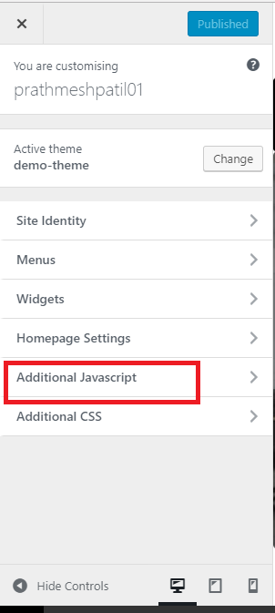
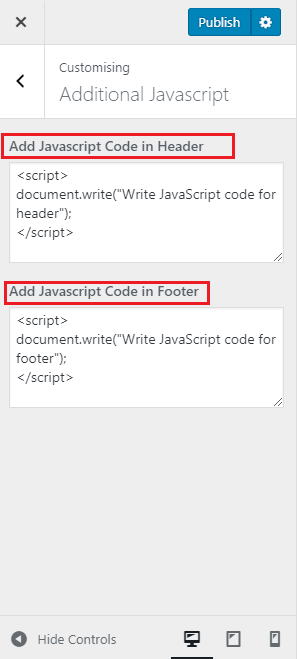

Additional JavaScript Plugin
=======
**Contributor:** prathmesh patil.

**Version:** 1.0.0 

## Description ##

  *  Upload Additional JavaScript in Header and Footer section via Customize option.
  
  

## Installation ##

* Install the plugin from the 'plugin' section in your dashboard (Go to `plugin > Add New > Upload`) upload zip file.
* Activate it through the 'plugin' section.

## Screenshots ##

### 1. Panel Name.

### 2. Upload Additional JavaScript in Header and Footer.

